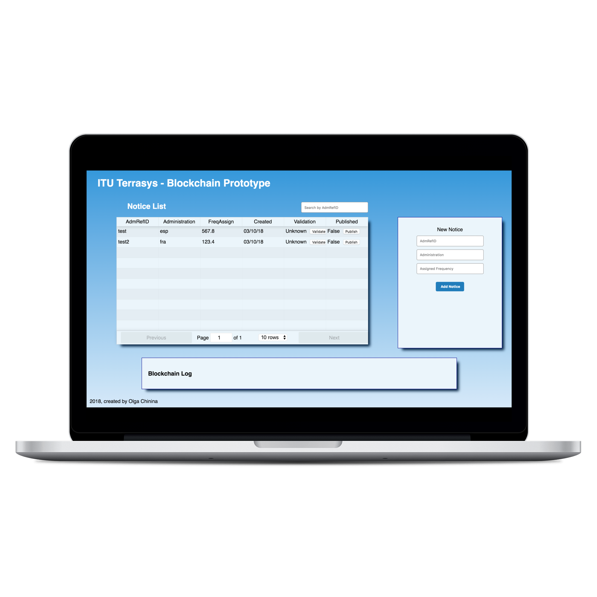

# Terrasys
Terrasys is a proof of concept to store assigned frequencies on the etherium blockchain. It's goal is to enhance a legacy system to become a blockchain dapp. Smart contract and blockchain implementation is work in progress.

## Screeshot


## Getting Started
### Prerequisites
- Node
- Npm
- MongoDB
1. **Clone the repo**
```
$ git clone https://github.com/chinins/terrasys.git
```
2. **Install dependencies on the server side**
```
$ cd server
$ npm install
```
3. **Start MongoDb**
```
$ mongod
```
4. **Start the sever**
```
$ node index.js
```
4. **Install dependencies on the client side**
```
$ cd ../client
$ npm i
```
4. **Start the react app**
```
$ npm start
```
## Tech Stack
- [React](https://reactjs.org/) - frontend framework
- [Koa](https://koajs.com/) - web framework for node.js
- [MongoDB](https://www.mongodb.com/) - document-oriented database program

## Authors
- Olga Chinina - [Github](https://github.com/chinins)
